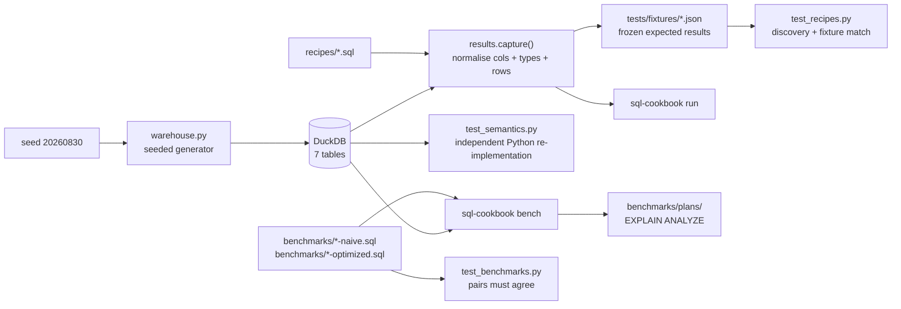

# sql-cookbook

> Advanced SQL patterns — window functions, recursive CTEs, gaps-and-islands,
> sessionization, pivots — every recipe runnable and tested on DuckDB.

[](https://github.com/Prithv122/sql-cookbook/actions/workflows/ci.yml)

**Live demo:** not deployed — runs locally, no server and no account required.
**Stack:** Python 3.13 · DuckDB 1.5.5 (embedded) · pytest · ruff · uv · GitHub Actions

---

## 1. The problem

SQL snippet collections rot silently. A query gets copied out of a blog post, the
dialect shifts, an `ORDER BY` turns out not to be total, and the thing still runs —
returning slightly wrong rows that nobody notices, because nothing was ever asserting
what the right rows were.

This repo is the opposite arrangement. Twelve analytical patterns, each a plain `.sql`
file you can paste into a DuckDB shell, each pinned to a frozen expected result and
executed by CI. If a recipe's output changes, the build breaks. The load-bearing ones
are additionally re-implemented in Python and compared, so the tests check the queries
are *right*, not merely unchanged.

It doubles as interview preparation: every recipe states the question it answers, and
`INTERVIEW.md` answers the five questions this project invites.

## 2. The data

| | |
|---|---|
| Source | **Synthetic.** Generated by `src/sqlcookbook/warehouse.py` from seed `20260830` |
| Size | 7 tables, 25,315 rows (400 customers · 3,000 orders · 9,001 order items · 12,301 page events · 530 subscription periods · 48 products · 35 employees) |
| Licence | None needed — no third-party data is used or redistributed |
| Refresh | `uv run sql-cookbook build`, deterministic: same seed, same rows |

**The dataset is synthetic, and every number below is a number about synthetic data.**
It is not a claim about real-world workloads. What it *is* good for: the data is
reproducible byte-for-byte, so expected results can be frozen into fixtures at all —
which is the entire premise of the repo.

The generator's shapes are chosen to give each recipe something real to find, rather
than to look realistic for its own sake:

- **Heavy-tailed order counts** (Pareto, α=2.5) so top-N has a genuine head instead of
  400 customers tied at seven orders each.
- **Subscription periods that overlap, abut, *and* lapse** — 70, 246 and 64 of each —
  because a merge that only handles abutment passes any test built from abutting data.
- **Browsing visits hours apart, events within a visit minutes apart**, so the correct
  sessionization is knowable without SQL and can be recomputed in Python to check the
  recipe.
- **One gap of exactly 30 minutes** (customer 7), to pin down the session boundary rule.
- **510 duplicated timestamps**, so recipe 12's tie-breaking problem is real rather than
  hypothetical.

## 3. Architecture



Three directories carry the content, and nothing is hidden in Python:

- `recipes/` — the cookbook. One question per file, a compact `-- Key: value` header,
  copy-pasteable SQL.
- `benchmarks/` — naive and optimized spellings of the same question as **separate
  executable files**, so the comparison can be run and verified rather than described.
- `tests/fixtures/` — expected results as JSON, including column names and types.

## 4. Key decisions & tradeoffs

| Decision | Chose | Over | Why |
|---|---|---|---|
| Where the naive query lives | A separate `benchmarks/NN-name-naive.sql` | A commented-out block inside each recipe | Keeps recipes copy-pasteable, keeps the naive query *executable* so a test can prove both spellings return the same rows, and keeps the README's timings reproducible |
| Fixture format | JSON with column names **and types** | CSV of values | A recipe that returns the right numbers under a silently re-typed column has still changed its contract. `DECIMAL` quietly becoming `DOUBLE` is exactly the regression worth catching |
| Trusting the fixtures | Independent Python re-implementations for the load-bearing recipes | Fixtures alone | A fixture generated from the query it checks freezes bugs as readily as behaviour. `test_semantics.py` recomputes running totals, sessionization and streaks from the base tables in plain Python |
| Warehouse loading | Rendering SQL literals, one `INSERT` per table | `executemany` with bound parameters | Measured 85× faster per row on this machine (see Results). The cost is per parameter bound, not per statement, so batching does not help |
| Data generation | Python's `random.Random(seed)` | DuckDB's `setseed()` + `random()` | Python's Mersenne Twister stream is documented as stable across releases; DuckDB's is not, and every fixture in the repo depends on that stability |
| Session boundary | Strictly `> 30 minutes` | `>= 30 minutes` | Either is defensible, so the choice is *pinned*: customer 7 has a gap of exactly 30 minutes and a test asserts it does not split |
| Money columns | `DECIMAL(10,2)` | `DOUBLE` | Float formatting instability would make byte-comparable fixtures impossible, quite apart from being wrong for money |
| Timing in CI | Correctness gates the build; speed does not | Asserting a speedup threshold | Wall-clock assertions on a shared runner fail for reasons that have nothing to do with the code |

## 5. Results

All figures below are from this repo on the documented machine, and every one is
reproducible with a command shown here. **The dataset is synthetic (see §2).**

### Coverage of the pattern set

| | |
|---|---|
| Recipes, each with a frozen fixture | **12 / 12** |
| Tests | **107 passed**, 90% statement coverage, 13.6 s |
| Benchmark pairs whose two spellings return identical rows | **3 / 3** |
| Warehouse build | 1.4 s in memory, 25,315 rows |

Patterns covered: running totals · `LAG`/`LEAD` · `RANK` vs `DENSE_RANK` vs `ROW_NUMBER`
· top-N per group · recursive org hierarchy · recursive date spine · gaps-and-islands ·
subscription lapse detection · 30-minute sessionization · DuckDB `PIVOT` · portable
conditional aggregation · tie-safe ranking.

Reproduce: `uv run pytest --cov=src`

### Naive vs. window-function, on the seeded warehouse

`uv run sql-cookbook bench --repeats 15`, median of 15 runs after one warmup, on an
Intel i7-8850H / Windows 11 / DuckDB 1.5.5 / Python 3.13.9:

| Benchmark | Naive | Optimized | Speedup | Rows |
|---|---|---|---|---|
| `01-running-total` | 43.7 ms | 28.1 ms | **1.56×** | 2,485 |
| `04-top-n-per-group` | 20.7 ms | 12.5 ms | **1.66×** | 1,126 |
| `09-sessionization` | 35.6 ms | 14.4 ms | **2.48×** | 2,218 |

Across three such runs the speedups ranged 1.53–1.67×, 1.58–1.88× and 2.48–2.86×
respectively; absolute milliseconds varied by roughly 25% run to run, which is why the
ratio is the number worth quoting and why nothing here gates CI.

**The interesting part is how small those numbers are.** The naive variants are
correlated subqueries — textbook quadratic shapes. They are not 100× slower, and the
saved plans say why: `benchmarks/plans/*-naive.txt` contain a **`DELIM_JOIN`**, DuckDB's
decorrelation operator. The optimizer rewrites the correlated subquery into a join
rather than executing it per row, so what is left is the cost of extra joins and
aggregations (naive `01` plans to 3 `HASH_JOIN` + 3 `HASH_GROUP_BY`; optimized plans to
1 of each plus a single `WINDOW`), not a blow-up.

So the honest claim is narrow: **on this data, on this engine, the window-function
spelling ran 1.6–2.5× faster, and the plans show the gap is extra relational operators
rather than quadratic scanning.** On an engine that does not decorrelate subqueries the
same SQL would degrade far worse — but that is a statement about those engines, and this
repo does not measure them.

Reproduce: `uv run sql-cookbook bench --save-plans`

### Why the loader renders literals

| Strategy | Rows | Seconds | µs/row |
|---|---|---|---|
| `executemany`, one row at a time | 2,000 | 8.56 | 4,281 |
| Parameterised, 50-row batches | 2,000 | 6.69 | 3,346 |
| **Rendered literals, one statement** | 9,001 | **0.45** | **50** |

Batching barely moves the per-row cost, which is what identifies the expense as
parameter *binding* rather than statement dispatch. Rendering literals skips binding and
is ~85× cheaper per row; warehouse build went from 58 s to 1.4 s, which is the
difference between a test suite you run and one you avoid.

Reproduce: `uv run python scripts/bench_loader.py`

## 6. How to run

Requires [uv](https://docs.astral.sh/uv/). Nothing else — no database server, no
account, no API key, no dataset download.

```bash
git clone https://github.com/Prithv122/sql-cookbook.git
cd sql-cookbook
uv sync
uv run sql-cookbook build      # writes data/warehouse.duckdb, ~1.4s
```

Then:

```bash
uv run sql-cookbook list                    # every recipe and the question it answers
uv run sql-cookbook run 04                  # by name or unambiguous prefix
uv run sql-cookbook bench --save-plans      # naive vs optimized, writes EXPLAIN ANALYZE
uv run pytest                               # 107 tests
```

`sql-cookbook run` prints what ran and what came back:

```
Recipe: 04-top-n-per-group
Question: What are each customer's three largest completed orders?

✓ Executed successfully
Rows: 9
Columns: customer_id, order_id, order_value, value_rank
```

To read the SQL rather than run it, open `recipes/` — the files are the point, and they
run unmodified in a plain `duckdb data/warehouse.duckdb` shell.

**Changing a recipe:** edit the `.sql`, run `uv run python scripts/refresh_fixtures.py`,
**read the diff**, then commit. The script reports `CHANGED` loudly for exactly this
reason.

**Note on local pytest (Windows):** if your environment blocks `%TEMP%`, run
`uv run pytest --basetemp=<some-writable-dir>`. This is deliberately not in
`pyproject.toml` — it is machine-specific and would break CI and clean clones.

## 7. What I'd change at 100× scale

At 100× (≈2.5M rows) the recipes themselves are the least of the problem — DuckDB will
still window-sort 300k orders comfortably. Four things break first, roughly in order:

1. **The loader, again.** Rendering a ~40 MB `INSERT` statement per table stops being
   clever and starts being an allocation problem. The fix is already identified and
   measured: CSV + `COPY` loaded the same rows in 0.07 s versus 0.45 s. I did not take
   it here because it drags temp-file handling into a library whose tests run entirely
   in memory — a bad trade at 25k rows, an obvious one at 2.5M.
2. **Fixtures.** Freezing whole result sets only works because the recipes are sampled
   down to 6–30 rows. At scale I would freeze a *digest* — row count, column types, and
   a checksum over ordered rows — and keep full fixtures only for the small samples
   where reading the diff is the point.
3. **The naive benchmarks.** `01-running-total` naive is quadratic in orders *per
   customer*. Today the heaviest customer has 83 orders; at 100× that is 8,300, and one
   `DELIM_JOIN` will not save it. That is the point at which the benchmark stops being a
   1.6× curiosity and starts being the argument for window functions — so I would keep
   it and let it get slow, rather than trim it.
4. **Single-file DuckDB.** Fine to hundreds of millions of rows on one box, and the
   right answer for a cookbook. Past that the recipes are the portable asset: the
   patterns move to Snowflake or BigQuery essentially unchanged, except `PIVOT`
   (recipe 10), which is exactly why recipe 11 exists.

The thing I would *not* change is the pairing of frozen fixtures with independent Python
checks. It caught a real defect during the build: recipe 03's original slice contained no
tied `order_count`, so `RANK`, `DENSE_RANK` and `ROW_NUMBER` returned identical columns
and the recipe silently demonstrated nothing. The fixture was perfectly happy. The test
that asserts a tie exists is what found it.

---

## References

No reference implementation was copied. The patterns are standard analytical SQL;
DuckDB's documentation for `QUALIFY`, `PIVOT` and `WINDOW` was consulted for dialect
specifics, and `EXPLAIN ANALYZE` output in `benchmarks/plans/` is DuckDB's own.
